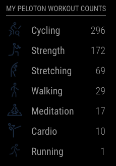
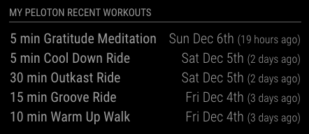
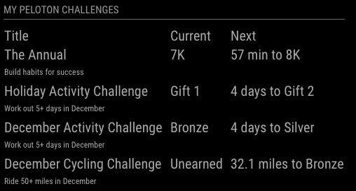

# MMM-Peloton

This is a MagicMirror module for people with a Peloton account.  This module will show you your Peloton information to help keep you motivated to achieve your goals, whatever they may be.

# Screenshots
|Display Type|Screenshot|
|------------|----------|
|Workout Count||
|Recent Workouts||
|Challenges||

# Prerequisites
* You should have an active Peloton account.  If you do not have an account you can [use this link](https://account.onepeloton.com/referrals/share?code=M2F9M7) to get an account.

# Installation

1. Go to the `modules` directory of your MagicMirror installation:
   ```sh
   cd ~/MagicMirror/modules
   ```
1. Clone this module into that folder:
   ```sh
   git clone https://github.com/chicohernando/MMM-Peloton.git
   ```
1. Configure this module in your MagicMirror config/config.js file
   ```js
   {
     module: "MMM-Peloton",
     position: "top_left",
     header: "My Peloton Workouts",
     config: {
       username: "username",
       password: "password",
     }
   },
   ```

# Configuration

There are multiple display types that can be configured for this module.  Depending on which `display_type` that you choose changes what configurations a relevant for you to configure.

## Generic

These are configuration options that are relevant no matter what `display_type` that you choose.

|Name|Type|Description|Default|Options|
|----|----|-----------|-------|-------|
|`refresh_every`|int|Defines, in seconds, how often the data should refresh|`300` (five minutes)|Numbers between the values of `60` (one minute) and `86400` (24 hours)|
|`username`|string|Your peloton username or email address|||
|`password`|string|Your peloton password|||
|`display_type`|string|Defines what type of data that your want this module to display|`workout_count`|`workout_count`, `recent_workouts`, `challenges`|
|`debug`|boolean|Control whether the module is in debug mode or not, this can be useful during setup if you are having difficulties|`false`|`true`, `false`|

## Workout Counts (`display_type` = `workout_count`)

These configuration options are available when your `display_type` is set to `workout_count`.

|Name|Type|Description|Default|Options|
|----|----|-----------|-------|-------|
|`workout_count_categories_to_omit`|array|An array of workout categories to omit from your display|`[]`|`cardio`, `circuit`, `cycling`, `meditation`, `running`, `strength`, `walking`, `yoga`|
|`workout_count_should_display_categories_with_zero_count`|boolean|Controls whether a category should display if you do not have any workouts in the category|`true`|`true`, `false`|
|`workout_count_sort_order`|string|Changes the order in which your workout categories display|`alpha_asc`|`alpha_asc`, `alpha_desc`, `count_asc`, `count_desc`|

## Recent Workouts  (`display_type` = `recent_workouts`)

This configuration option is available when your `display_type` is set to `recent_workouts`.

|Name|Type|Description|Default|Options|
|----|----|-----------|-------|-------|
|`recent_workouts_limit`|int|Controls how many workouts to display|`5`|Numbers between the values of `1` and `10`|

# Example Configurations

You may configure this module more than once.  Each configuration needs to redefine the username and password.  This allows multiple people to have their own data displayed at the same time.

1. One user that only wants to show their workout counts by category.  They do *not* want to see counts for the Yoga category nor categories where the count is zero.  They would like to see the workouts ordered by count descending.
   ```js
   {
     module: "MMM-Peloton",
     position: "top_left",
     header: "My Peloton Workouts",
     config: {
       username: "my_username",
       password: "my_password",
       display_type: "workout_count",
       workout_count_categories_to_omit: ["yoga"],
       workout_count_should_display_categories_with_zero_count: false,
       workout_count_sort_order: "count_desc",
     }
   },
   ```
1. Two users that both want to show their Recent Workouts and Current Challenges.  "My" user is on the left and "Your" user is on the right.
   ```js
   {
     module: "MMM-Peloton",
     position: "top_left",
     header: "My Peloton Challenges",
     config: {
       username: "my_username",
       password: "my_password",
       display_type: "challenges",
     }
   },
   {
     module: "MMM-Peloton",
     position: "bottom_left",
     header: "My Peloton Recent Workouts",
     config: {
       username: "my_username",
       password: "my_password",
       display_type: "recent_workouts",
     }
   },
   {
     module: "MMM-Peloton",
     position: "top_right",
     header: "Your Peloton Challenges",
     config: {
       username: "your_username",
       password: "your_password",
       display_type: "challenges",
     }
   },
   {
     module: "MMM-Peloton",
     position: "bottom_right",
     header: "Your Peloton Recent Workouts",
     config: {
       username: "your_username",
       password: "your_password",
       display_type: "recent_workouts",
     }
   },
   ```
